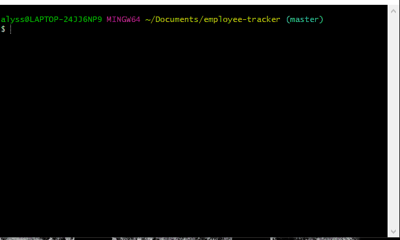

# employee-tracker

Fully functioning Employee tracker built into the command line.
You can view all employees, managers, departments, and roles.
You will also be able to add/update/delete data.

This demo shows all tables and how to add an employee:

